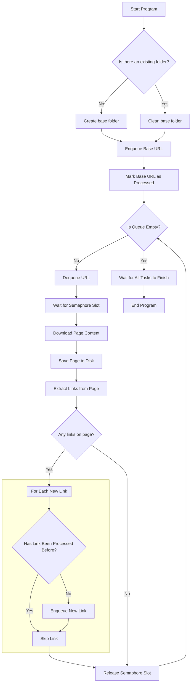

# BookScraper
This repo is a solution to the tretton37 assignment.
I've solved it with a console application in .NET/C#. The version used is the latest LTS (.NET8).

## Introduction
In the base commit, I've setup an editorconfig file, a gitignore file, and added the StyleCop nuget package to the solution build props, so that all projects that might be created in the solution will get that nuget.

## How to use
Just run through console or Visual Studio debugger. The folder containing the site is created inside the project bin folder so not needed to run with elevated permissions.

## Flowchart
