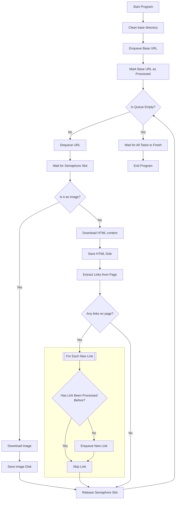

# BookScraper
This repo is a solution to the tretton37 assignment. The assignment is to scrape the website https://books.toscrape.com/ so that it can be viewed locally.
I've solved it with a console application in .NET/C#. The version used is the latest LTS (.NET8).

## Introduction
In the base commit, I've setup an editorconfig file, a gitignore file, and added the StyleCop nuget package to the solution build props, so that all projects that might be created in the solution will get that nuget.

### Building blocks
- `LinkMessageBus`
  - The message bus that keeps track of the urls to process. Has a backing ConcurrentQueue (in-memory).
- `Producer`
  - The piece that queues up new urls to process.
- `Consumer`
  - The consumer the queue. Several are created to work in parallel. An instance of `SemaphoreSlim` is utilized to not run out of any resource.
- `ProgressViewer`
  - The piece that shows the progress during processing.
- `QueueMonitor`
  - This service creates a cancellation token when instantiated. This token is used by all consumers and by the progress viewer so that they know that there's nothing more to process once the queue is emptied.
  - There is a slight delay before this service starts, in order to make sure that something has entered the queue, else it would indicate exit before the processing had started.

## Prerequisites
.NET8

## How to use
Just run through console `dotnet run` or Visual Studio debugger.

> The folder containing the site is created inside the project bin folder so it's not needed to run with elevated permissions.

During processing, you'll see the progress and when finished you'll get the directory where the site is saved locally.

## Notes
### Caveats
- In a real scenario, I'd probably use Dependency Injection but in this assignment I skipped it to keep it focused on the task at hand. 
- Tests would also be added to confirm that it works as expected.
- Exception handling and logging should be improved. In a real case I'd use a separate logger set up in the DI container.
- I didn't sprinkle the code with comments as I write this documentation, and we'll have a review together.
- The dynamic content (*Products you recently viewed*) is static in this example. In a real example I would have skipped this part, as it would have been dependent on some session-storage.
- FontAwesome source is embedded in the `css`. To download that as well the css would have to be analyzed. I skipped that as if one would like to get the rating, it's possible to extract from the css classes used in the html files.
- The .editorconfig is one that I tend to use in different labs, but the latest release of StyleCop is not up to date with some .NET8 features, therefore some warnings are strange and I've ignored them.
- Usually I would clean up the commits, but now I've left them for you to follow my progress during the work.
- This was the most advanced thing that I've done with threading this far, so I took the opportunity to learn and experiment and am now looking forward to a nice code review.

### Reasoning
I've experimented with the thread count and read a bit on what level is appropriate for I/O intensive operations. I saw the number 2.5 times the cores so I tested that and some other settings. My machine has 16 cores so 40 threads.
I tested that and some other configurations and 2.5 (40 threads) seems to be a sweet-spot, at least on my machine.

| Thread Count | Execution Time |
|--------------|----------------|
| 1            | 406,852 ms     |
| 20           | 25,397 ms      |
| 40           | 15,808 ms      |
| 80           | 15,274 ms      |

> It's important that `QueueMonitor` always gets a thread as this service has the responsibility to invoke Cancel on the token. At first, sometimes this didn't happen or took a long time.
> I solved this by telling .NET to use a dedicated thread (by setting `TaskCreationOptions.LongRunning`) and used a syncronous wait (`Thread.Sleep` inside the `while` loop) to not release the thread once it has started.

I added a semaphore for writing files, as it happened that two threads started to process the same file (in the beginning several threads can pick up the base `index.html` before it has been inserted in the dictionary of finished files).
This restriction doesn't seem to affect the performance too much when testing.

My first thought was something like the flowchart below, which I made before starting the assignment, to get a grasp of the stages.
It worked for the one-thread scenario, but for the threaded scenario I opted for a queue-based solution. I leave it here either way, as it's conceptually accurate although it's not showing the threading logic.

#### Flowchart
